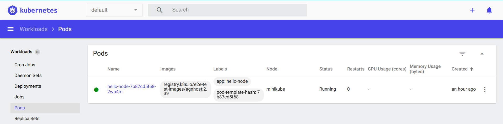

## Overview

Cluster administrators can use the `kubectl` command line interface (CLI) tool to debug pods, services, and other issues in Kubernetes clusters. This article describes some basic `kubectl` commands to *debug pods* in your cluster.

## Prerequisites

- One or more pods are running in a cluster.
- You have sufficient permissions to access the cluster and execute commands using the `kubectl` CLI. 

## Common commands for debugging pods

As a best practice, debug pods using the following sequence of operations:

1. Display a list of pods and their status.
2. Display the logs for specific or all containers in a pod.
3. Execute commands in a specific container.
4. Debug pods using their clones for interactive debugging.

This section describes the relevant commands that support the suggested sequence.

### **kubectl get pods**

To get basic information about the list of available pods and their status, use the following command:

**Syntax**

```shell
$ kubectl get pods
```

You can also list pods for a specific namespace by using the `--namespace` option:
```shell
$ kubectl get pods --namespace=NAMESPACE
```

**Example**:

```shell
$ kubectl get pods --namespace=default
```

```shell
NAME                          READY   STATUS    RESTARTS   AGE
hello-node-7b87cd5f68-2wp4m   1/1     Running   0          21m
```

Alternatively, you can access the pods from a browser-based Kubernetes dashboard:



Click a pod to display its details.

### **kubectl logs**

To display a snapshot of the logs of containers running inside a pod, use the following command:

**Syntax**

```shell
$ kubectl logs POD --all-containers=true
```

To display a snapshot of logs for a specific container running in a pod, use the following command:

```shell
$ kubectl logs -p -c CONTAINER POD
```

> **Note**: If a pod has a single container, the name of the container is accepted as the default argument.

**Example**

```shell
$ kubectl logs hello-node-7b87cd5f68-2wp4m
```

```shell
I0715 06:51:04.198447       1 log.go:195] Started HTTP server on port 8080
I0715 06:51:04.198572       1 log.go:195] Started UDP server on port  8081

```

### **kubectl exec**

To execute a shell command in a specific container, use the following command:

**Syntax**

```shell
$ kubectl exec POD -c CONTAINER -- SHELL-COMMAND
```

By default, the command is executed in the first container of the pod if you do not provide the name of a specific container.

**Example**

Execute the `date` command in a container of the `hello-node-7b87cd5f68-2wp4m` pod:

```shell
$ kubectl exec hello-node-7b87cd5f68-2wp4m -- date
```

```shell
Sat Jul 15 08:05:14 UTC 2023
```

### **kubectl debug** 

To debug cluster resources using interactive debugging containers, use the following command:

**Syntax**

```shell
$ kubectl debug POD -it --image=IMAGE
```

**Example**

```shell
$ kubectl debug hello-node-7b87cd5f68-2wp4m -it --image=busybox
```

```shell
Defaulting debug container name to debugger-55rjd.
If you don't see a command prompt, try pressing enter.
/ # 
/ # 
/ # pwd
/
/ # ls -a
.           .dockerenv  dev         home        lib64       root        tmp         var
..          bin         etc         lib         proc        sys         usr
/ # ls -alrt
total 4
lrwxrwxrwx    1 root     root             3 Jun 24 00:04 lib64 -> lib
drwxr-xr-x    1 root     root           270 Jun 24 00:04 lib
drwxr-xr-x    1 root     root          4758 Jun 24 00:04 bin
drwxr-xr-x    1 root     root            16 Jun 24 00:04 var
drwxr-xr-x    1 root     root            14 Jun 24 00:04 usr
drwxrwxrwt    1 root     root             0 Jun 24 00:04 tmp
drwxr-xr-x    1 nobody   nobody           0 Jun 24 00:04 home
dr-xr-xr-x   13 root     root             0 Jul 15 06:50 sys
dr-xr-xr-x  565 root     root             0 Jul 15 08:18 proc
drwxr-xr-x    1 root     root            56 Jul 15 08:18 etc
drwxr-xr-x    5 root     root           380 Jul 15 08:18 dev
-rwxr-xr-x    1 root     root             0 Jul 15 08:18 .dockerenv
drwxr-xr-x    1 root     root             8 Jul 15 08:18 ..
drwxr-xr-x    1 root     root             8 Jul 15 08:18 .
drwx------    1 root     root            24 Jul 15 08:19 root
/ # exit
Session ended, the ephemeral container will not be restarted but may be reattached using 'kubectl attach hello-node-7b87cd5f68-2wp4m -c debugger-55rjd -i -t' if it is still running
```

## Additional resources

For detailed information on debugging pods in a Kubernetes cluster, refer to the following resources:

- [Debug Running Pods](https://kubernetes.io/docs/tasks/debug/debug-application/debug-running-pod/)