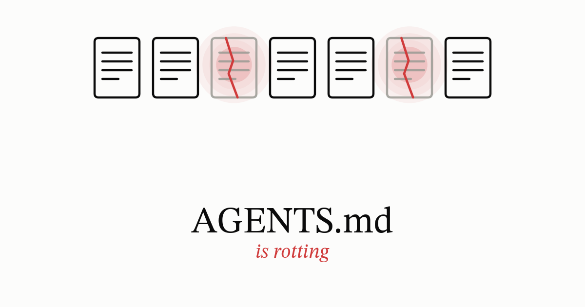

{fig-align="center" width="65%"}

A file at the root of your repository tells an AI agent how to work there. `AGENTS.md`, `CLAUDE.md`, `GEMINI.md`, `.cursorrules`, `copilot-instructions.md`, whatever your tooling calls it. If you have been running agents for more than a few months, that file has grown and is at least partially false. The problem is maintenance, not writing.

## The file

I made up parts of this:

```markdown
# Notes for AI agents working in this repo

Please be careful. This code ships to customers.

## Setup
Install dependencies with `dnf install -y make git python3-pip`.
Run `./scripts/bootstrap.sh` before anything else.

## Testing
Always run the full test suite before proposing a change.
If the suite takes too long, use your judgment about which parts to skip.

## Git
Never force-push.
Force-pushing to your own feature branch is fine, just not to main.
Squash your commits.

## Build
Target is Fedora 42.
Do not touch src/gen — after the March incident this must be left alone.
Be careful when changing the test fixtures.
Check with the team before editing the CI config.

## Style
Follow the existing code style.
It would be nice if you could add tests for new code.
```

Read it once and it sounds like a helpful note from a colleague. Read it against the actual repo and four things are wrong.

- `dnf install` is right on Fedora, and Fedora CoreOS doesn't ship `dnf` at all. If you don't have product-specific variants, the agent gets `command not found` — or, if the script swallows the exit code, fails silently instead.

- The Git section contradicts itself: never force-push, and then force-pushing to your own feature branch is fine. The agent does not know which one wins.

- `bootstrap.sh` moved into the Makefile last year and was deleted, but the line survived. Fedora 42 became Fedora 43 two quarters ago. The March incident was two Marches ago.

- Then the sentences that are not instructions at all: be careful, use your judgment, check with the team, it would be nice if you could add tests. Bad documentation produces the same sentences. *Consult your system administrator. Use caution when modifying this value.* I have written both. None of them can be followed or checked.

Whichever agent you run, the file is text in a prompt, not a parsed config. Claude Code's documentation says so plainly: **"no guarantee of strict compliance, especially for vague or conflicting instructions"** [@claudecode2026]. The file above is both.

## How bad is it

ETH Zurich found that adding a context file did not generally improve task success, and raised inference cost by more than 20% on average. They tested on SWE-bench tasks and on a benchmark of repositories that already had hand-written files, and the result held across models and agents, whether the file was hand-written or generated [@gloaguen2026].[^ethnuance] The same study's trace analysis shows just how mechanically agents comply: a tool got used far more often in the instances where the context file named it than in the instances where it didn't.

On focused pull requests, a second study found the opposite on cost: runs with a context file finished with roughly 29% better median runtime and 17% better token use than runs without one [@lulla2026]. The two studies aren't testing the same kind of task. An open bug on SWE-bench is something an agent has never seen before; a focused pull request is usually a change the author already understands. A context file can plausibly make an agent faster at work it's already been pointed toward. That's a different claim from making it better at work it has to figure out on its own.

Line the two up and the real takeaway is smaller than either study on its own: cost tracks how familiar the task already is, and only ETH actually measured whether the work gets done better — it found no reliable improvement there either. On an unfamiliar problem, a file that earns nothing still costs tokens, and a false line in it gets followed on top of that.

## Why it rots

Every fault in that file has the same cause. The file has no lifecycle.

Nothing owns it, so no one is responsible when it drifts. Nothing generates it, so variants are made by copying. Nothing tests it, so a path that stopped existing looks identical to one that still does. Nothing fails when it is wrong, so the feedback that fixes code never reaches it. Code has all four. This file has none.

Nobody gets a ticket or a review credit for owning the file, so nobody does. And blocking a merge over *use caution* costs the reviewer more than waving it through, which is why empty rules pile up.

The faults split into two kinds, and each needs different treatment. Dead paths, stale versions and wrong commands are mechanical: a script can check every path, command and version the file names, and it will still be checking them next year. Contradictions and empty rules are not. No tool reads *never force-push* against *force-pushing to your own feature branch is fine* and reports a conflict, and none will tell you *be careful* is not an instruction. Those need a person.

## Auditable, then enforced

A rule is auditable when you can tell from the diff whether it held. This one is not:

> Be careful when changing the test fixtures.

This one is:

> Do not edit anything under `tests/fixtures/`. If a test needs a different fixture, stop and say which fixture and why.

An auditable rule is still not an enforced one. An instruction file is text in a context window, competing with everything else in it, and on a long session it can lose. Better models do not fix this. A good guess just makes the failure quieter, because nobody checks a guess that worked.

So sort by consequence. If a violation would fail the build, put it in the build: every agent ships a hook or permission layer, and pre-commit and CI were there before any of them. The file keeps what a reviewer would query and no gate would catch.

The fixture rule belongs in the file. A pre-commit hook that rejects any edit under `src/gen` does not depend on the agent cooperating.

## Variants, without four copies

Instructions differ by version and by variant. 6.1 needs different guidance from 6.2. Fedora and Fedora CoreOS need different install commands, as above.

If your variants map to directories, the tooling already handles it. Nested `AGENTS.md` files scope to their own subtree, and the more specific one wins on conflict — the same mental model as `.gitignore`.[^nested] Most agents also take imported or path-scoped rules on top of that.

They often do not map. Fedora against Fedora CoreOS is not a directory split, and neither is 6.1 against 6.2. So people copy the file and edit the copy. After a year there are four of them, three stale, and nobody can say which one the agent loaded on a given run. Git will not catch it: four divergent files are not an error.

Documentation toolchains have a name for this problem: conditional compilation, applied to prose. They borrowed `ifdef` from the C preprocessor for the reason it exists there in the first place: one source, built per target, instead of four copies drifting apart on their own. Write one source with conditionals and generate the per-target file:

```asciidoc
== Installing packages

ifdef::fedora[]
Run `dnf install -y make git python3-pip`.
endif::[]

ifdef::coreos[]
Root is read-only. Run `rpm-ostree install make git python3-pip`,
then reboot to activate the new deployment.
Do not use plain `dnf install` on these hosts.
endif::[]
```

Build per target and the agent gets a plain `AGENTS.md` with no conditionals in it. Change one path and the other is on the adjacent line.

The generated file rots too, so treat it like any other generated artifact: a build target that produces it, a CI job that regenerates and fails on a diff, and the output in `.gitignore` so nobody edits the artifact instead of the source.

## What each approach costs

| Approach | Handles | Costs | Revisit when |
|---|---|---|---|
| Leave it, delete quarterly | Drift, contradictions | Nothing but discipline. No variant support | You add a second target |
| Nested files | Variants that map to directories | A nested file can silently override a rule from the root | A rule has to hold everywhere |
| Generate from one source | Variants by product or version | A build target, a CI check, one more thing that can break the build | The variant count stops growing |
| Hook or CI gate | Rules that must hold | Code to maintain, and it will block legitimate work sometimes | The gate fires more on false positives than real ones |

Two of these rows are cheap, and they buy most of the value. Deleting on a schedule costs nothing and fixes contradictions, dead paths and stale versions. Nested files cost nothing extra either, once your variants actually map to directories — the tooling was already going to do that for you. For one repo, one target and two people, those two rows are the whole answer. Generation is the expensive row: worth it once you're at two targets, hard to justify at one, and I have not seen anyone run it for instruction files specifically, so treat it as a mechanism rather than a practice.

## What to do this week

1. **Find out what actually loads.** Claude Code lists the files in effect under `/context` [@claudecode2026]; Codex can log its instruction chain [@openaicodex2026]. A file missing from that list is invisible to the model. Codex also caps instruction text at 32 KiB by default and truncates past that, silently.[^codexcap]
2. **Diff the file against reality.** Every path, command and version number it names. Write it as a script the first time, because you will run it again. This is the pass that finds `bootstrap.sh`.
3. **Delete.** Anything the model already does, anything contradicted elsewhere, anything you cannot date.
4. **Add an owner and a date.** `Owner: platform team. Reviewed: 2026-08-14.` Without them nobody can tell a live rule from a dead one.
5. **Rewrite the vague rules as checkable ones,** and move the absolute ones into a hook.
6. **Only then**, if you have more than one target, set up generation with the CI diff check.

Steps 1 to 4 are an afternoon and cover most of the damage. Step 6 needs a decision first.

## How you know it worked

**The file loads.** Check `/context` or your agent's equivalent, and check the byte count against your tool's cap.

**The file is true, mechanically.** CI regenerates and fails on a diff, and the script from step 2 asserts every path, command and version still exists. Nobody has to remember to look.

**Nothing checks the other half.** No script reads two rules against each other and flags the contradiction, and none reads *it would be nice if you could add tests* and tells you that's not an instruction. This still needs a person, and a calendar entry. It's the half that gets skipped.

**The hard rules hold.** Try to violate them. Edit something under `src/gen` and confirm the hook rejects it.

**Whether the file helps at all is not testable with what you have.** The two studies point in different directions depending on the task and the metric — cost went up in one, down in the other — and settling it for your own team means running A/B tests on tasks with known-good outcomes. What you can actually claim is narrower: the file loads on every run either way, and it is now true rather than false.

The failure to watch for is a stale rule followed correctly. Go back to that ETH trace analysis: a tool got used far more often when the context file named it than when it didn't, and the measurement doesn't ask whether the file was still right to name it. A stale rule gets followed just like a current one, so it looks like success too. That's why it survives review. The date on the file is what catches it.

## Solved twice already

Conditional compilation is the one piece of this that's a straight borrow from engineering — documentation toolchains took `ifdef` because keeping prose in sync with the code it lives next to is easier when both use the same trick for the same problem.

The rest isn't a borrow so much as a parallel invention. Technical writing has its own long answer to keeping a large, cross-referenced body of text true across versions and products — single-sourcing, structured authoring, versioned doc builds — developed to solve the documentation side of this problem on its own terms. Applying that discipline to prose is a different job than applying it to code: you cannot compile a sentence or unit-test a paragraph.

Instruction files are the same problem on a smaller scale. It has to happen on a schedule, and it has to be somebody's job. In most repositories it is nobody's.

[^ethnuance]: Hand-written files moved success up a little — about 4% on average, for three of the four agents tested. LLM-generated files moved it down, in most of the settings tested. Call both effects noise: neither was large or consistent enough to justify the added cost.

[^nested]: More precisely, at least for Codex: it concatenates every ancestor `AGENTS.md` from the project root down to the working directory, with the nearest file placed last so it overrides on conflict. A rule in the root file still applies anywhere a more specific file doesn't override it. Claude Code's CLAUDE.md hierarchy and Cursor's rules work the same way: additive, with the more specific file winning only where it actually conflicts.

[^codexcap]: The setting is `project_doc_max_bytes`, defaulting to 32 KiB. Codex logs a warning internally when it truncates, but nothing surfaces that warning in the interactive CLI — which is why it reads as silent in practice.
