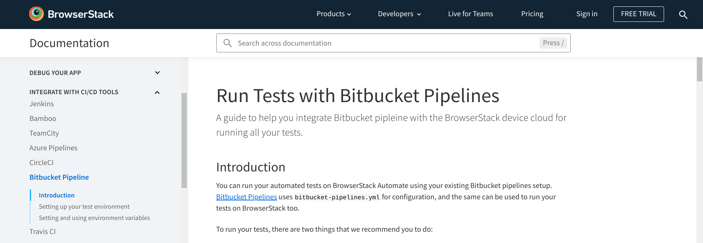
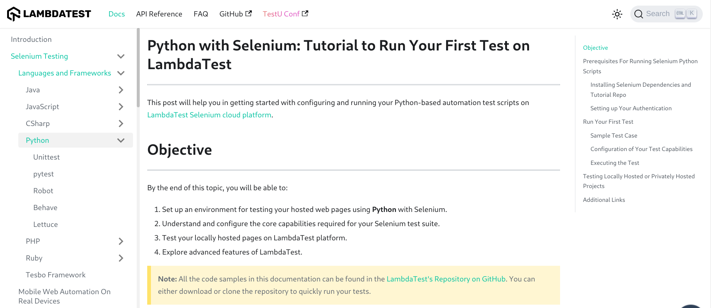

Based on my 30-minute analysis of BrowserStack's documentation and comparing with a competitor's documentation, I don't find anything that I strongly dislike. However, as a technical writer trained to pay attention to details, I have the following nitpicks.

## 1. Principles of minimalism are not followed

For example, in *Getting started → Python → Prerequisites*, the first bullet point is verbose.

Existing sentence:

> You need to have BrowserStack Username and Access key, which you can find in your account settings. If you have not created an account yet, you can sign up for a Free Trial or purchase a plan.

Suggested sentence:

> Note your BrowserStack Username and Access key from the account settings. Unregistered users can sign up for a trial account or purchase a plan.

The suggestion also demonstrates restructuring of sentences to emphasize the user's actions, and brings more clarity.

## 2. Section headings are not in gerund form

For example, in *Getting started → Python → Run your first test*:

- Existing heading: "Run your first test"
- Suggested heading: "Running your first test"

Gerund forms of phrases are appropriate for highlighting a process, which might contain several steps. For the steps, we can use action-oriented sentences in simple present tense, such as "Create a sample test code file".

## 3. Admonitions are misused

For example:

- The following Warning should ideally be a Caution, because the user needs to be mindful about adding the `driver.quit()` statement at the end of the code.
- "Protip" is not a standard admonition. Instead, use Tip.

::: {.callout-warning}
The `driver.quit()` statement is required, otherwise the test continues to execute, leading to a timeout.
:::

::: {.callout-tip}
You can use our capability builder and select from a wide range of custom capabilities that BrowserStack supports.
:::

## 4. Some unnecessary images

Images could have been used more sparingly to avoid maintenance problems. This is even more important for images that represent products such as GitHub, which are beyond BrowserStack's control.

In addition, images without appropriate alt text hamper accessibility and SEO.

## 5. Doc site UI/UX can be improved

Modern documentation websites adopt a three-column approach: documentation suite navigation on the left, content in the middle, and current page ToC on the right. BrowserStack's documentation website mostly leaves the right column blank. As a result, the left navigation panel looks more crowded and needs frequent scrolling.

For comparison, here's LambdaTest's documentation site, which puts the right-hand column to good use with an on-page table of contents:

## 6. General comments

- Some navigation links within the text/content are broken, especially the ones that navigate to different sections within the same article.
- In lots of occasions, the writing style deviates significantly from Google's documentation style guide. In fact, a seasoned writer can easily identify the documents contributed by developers, testers, product managers, or customer support. While this is not a big problem, the documentation experience can certainly be made more consistent.

## 7. Bonus

Modern test environments, especially in enterprise situations, are mostly containers running on clusters. If the onboarding docs describe procedures using containers, the onboarding experience and the documentation becomes more standardized and maintainable.
