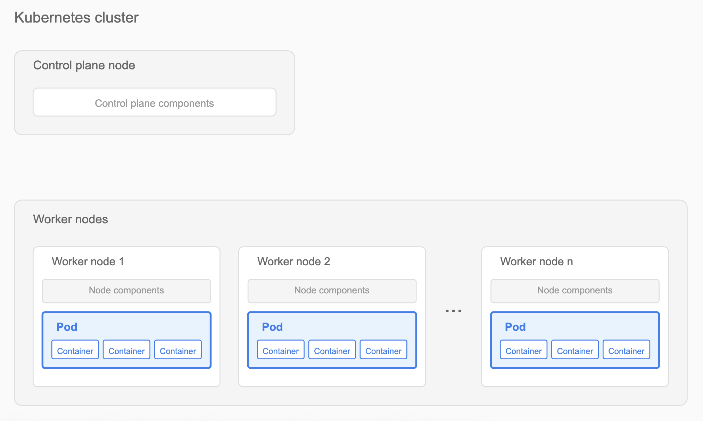
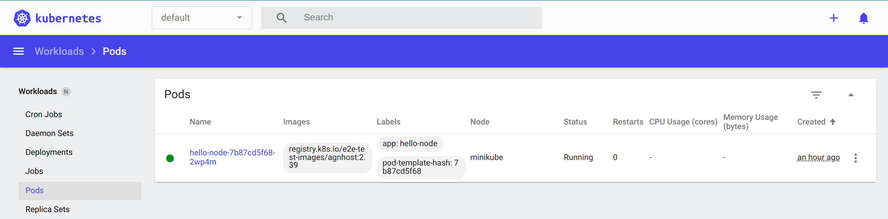

## Overview

Pods are the smallest deployable units in Kubernetes and critical to application functionality. Debugging pods helps ensure applications run smoothly, scale seamlessly, and use cluster resources effectively.



This article helps Kubernetes cluster administrators and developers diagnose and troubleshoot pod issues. After reading, you will be able to:

- Inspect pod status in a cluster.
- Analyze logs for debugging.
- Execute shell commands within containers.
- Use ephemeral containers for interactive debugging.

## Prerequisites

Before starting, verify that you have:

- Access to a Kubernetes cluster with running pods.
- Sufficient permissions to execute `kubectl` commands.

## Debugging pods in a Kubernetes cluster

The following sections describe common debugging techniques. Use these techniques sequentially or combine them based on your specific scenario.

### 1. What does pod status tell you?

Begin debugging by checking the status of your pods.

To list all pods:

```bash
kubectl get pods
```

To list pods in a specific namespace:

```bash
kubectl get pods --namespace=<namespace-name>
```

Example:

```bash
kubectl get pods --namespace=default
```

Expected output:

```
NAME                                READY   STATUS             RESTARTS   AGE
hello-node-7b87cd5f68-2wp4m        1/1     Running            0          21m
nginx-deployment-66b6c48dd5-8k4h2  0/1     Pending            0          5m
redis-master-58db8984f-xp4c8       0/1     ImagePullBackOff   0          2m
```

::: {.callout-tip}
If a pod is stuck in `Pending` status, check cluster resource availability by running the following command:

```bash
kubectl describe node <node-name>
```
:::

For a graphical interface, use the Kubernetes dashboard:

1. Open the Kubernetes dashboard.
2. Navigate to the *Pods* section.
3. Select a pod to view its details.



### 2. What do the logs reveal?

Logs help identify what a container is doing or why it failed.

To view logs from all containers in a pod:

```bash
kubectl logs <pod-name> --all-containers=true
```

To view logs from a specific container:

```bash
kubectl logs <pod-name> -c <container-name>
```

::: {.callout-note}
For pods with a single container, omit the container name.
:::

Example:

```bash
kubectl logs hello-node-7b87cd5f68-2wp4m
```

Expected output:

```
I0715 06:51:04.198447       1 log.go:195] Started HTTP server on port 8080
I0715 06:51:04.198572       1 log.go:195] Started UDP server on port 8081
```

::: {.callout-tip}
For pods in `CrashLoopBackOff` status, check logs with the `--previous` flag to see the last container's logs before it crashed:

```bash
kubectl logs <pod-name> --previous
```
:::

### 3. How do you inspect inside a container?

Inspect container state by running shell commands directly inside it.

Syntax:

```bash
kubectl exec <pod-name> -c <container-name> -- <command>
```

::: {.callout-note}
If not specified, commands run in the first container of the pod.
:::

Check container environment variables:

```bash
kubectl exec nginx-deployment-66b6c48dd5-8k4h2 -- env
```

Expected output:

```
PATH=/usr/local/sbin:/usr/local/bin:/usr/sbin:/usr/bin:/sbin:/bin
HOSTNAME=nginx-deployment-66b6c48dd5-8k4h2
NGINX_VERSION=1.21.1
NJS_VERSION=0.6.1
PKG_RELEASE=1~buster
HOME=/root
```

Verify network connectivity:

```bash
kubectl exec nginx-deployment-66b6c48dd5-8k4h2 -- curl -I localhost:80
```

Expected output:

```
HTTP/1.1 200 OK
Server: nginx/1.21.1
Date: Tue, 14 Jan 2025 10:15:23 GMT
Content-Type: text/html
Content-Length: 612
Connection: keep-alive
```

Check running processes:

```bash
kubectl exec nginx-deployment-66b6c48dd5-8k4h2 -- ps aux
```

Expected output:

```
USER    PID  %CPU  %MEM   VSZ   RSS TTY STAT START TIME COMMAND
root      1   0.0   0.1 10640  5548 ?   Ss   10:00 0:00 nginx: master process
nginx    31   0.0   0.1 11088  5164 ?   S    10:00 0:00 nginx: worker process
```

::: {.callout-tip}
For containers that crash immediately, create a copy of the pod with a sleep command:

```bash
kubectl debug <pod-name> --copy-to=<pod-name>-debug --container=<container-name> -- sleep 1d
```
:::

### 4. When should you use ephemeral containers?

Ephemeral containers let you attach debugging tools to running pods without modifying the original containers. They are especially useful when a container's image lacks a shell or debugging utilities.

To create an ephemeral debug container:

```bash
kubectl debug <pod-name> -it --image=<debug-image>
```

Debug networking issues using `netshoot`:

```bash
kubectl debug nginx-deployment-66b6c48dd5-8k4h2 -it --image=nicolaka/netshoot
```

Expected output:

```
Defaulting debug container name to debugger-nx8j2.
If you don't see a command prompt, try pressing enter.
~ # dig kubernetes.default.svc.cluster.local
~ # curl -v telnet://nginx-service:80
~ # tcpdump -i any port 80
```

Analyze memory usage with tools:

```bash
kubectl debug redis-master-58db8984f-xp4c8 -it --image=ubuntu
```

Expected output:

```
Defaulting debug container name to debugger-7xj4d.
If you don't see a command prompt, try pressing enter.
root@redis-master-58db8984f-xp4c8:/# apt-get update
root@redis-master-58db8984f-xp4c8:/# apt-get install -y procps
root@redis-master-58db8984f-xp4c8:/# top
...Memory usage details...
```

::: {.callout-tip}
For pods with `ImagePullBackOff` status, verify the image name and registry credentials. Check image pull secrets using:

```bash
kubectl get pod <pod-name> -o=jsonpath='{.spec.imagePullSecrets[0].name}'
```
:::
