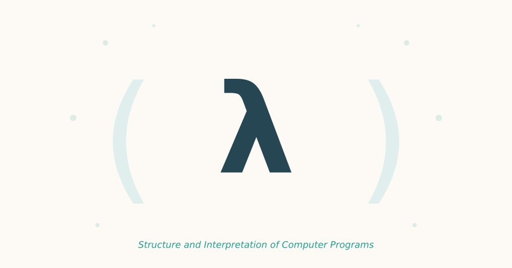

{fig-align="center" width="60%"}

*Structure and Interpretation of Computer Programs* doesn't spend its introduction on syntax. Abelson and Sussman use those opening pages to lay out what programming actually is, and it's dense enough to reward stopping and writing things down. What follows are the lines worth underlining, adapted into my own words.

## Responsibility

We are not really "responsible" for the successful, error-free, perfect use of our programs. We are responsible for creating them, for setting them off in a direction. The same, I think, can be said about our responsibility toward our own mind — we shape it and send it off, but we don't get to dictate every outcome downstream.

## On large problems

An assault on a large problem is carried out through a succession of programs, most of which spring into existence along the way, unplanned. It doesn't matter what these programs are about or which applications they end up serving. What matters is how well they perform and how smoothly they combine with other programs, in the creation of still greater ones. The programmer's task is to pursue both *perfection of plan* and *adequacy of collection* — the individual piece has to be right, and the pieces have to fit.

## Programming as a model

There's a chain here worth sitting with: *human mind* ↔ *collection of computer programs* ↔ *computers*. Every program is a model hatched in the mind of some real or mental process, and like any model it evolves as our understanding of that process improves. The program is never the thing itself — it's a working sketch we keep redrawing.

## Program truth

We become convinced of a program's truth the same way we become convinced of anything symbolic: through argument. If a program's function can be stated in the language of predicate calculus, the proof methods of logic become available to make that argument rigorous rather than persuasive.

## Growth of programs

Since large programs grow out of small ones, it's essential to build up an arsenal of standard structures and idioms. These constructions then combine into larger structures using organizational techniques of proven value. Nothing large is written from scratch; it's assembled from pieces that have already earned their keep.

## Hardware and programming

Each leap in hardware invites more ambitious programming, new organizational principles, and a richer set of abstract models — and in the present moment, the traffic runs the other way too: new programming techniques are driving the exploitation of hardware. Probabilistic software for machine learning is the clearest example. The advance of SIMD processors, CPUs, and storage has moved in lockstep with the growth of machine learning and deep learning applications, each pushing the other forward.

## The programmer's role

A programmer should acquire good algorithms and good idioms, and it's their responsibility to keep examining and improving how those idioms perform. Knowing a technique isn't the finish line; the finish line keeps moving as long as you keep looking at what you already know.

## Software and AI

The core concerns of software engineering and of artificial intelligence tend to converge as the systems under study grow larger. At small scale the two fields look like they're asking different questions; at large scale, they turn out to be *the same question asked from different starting points*.

## The nature of programming languages

A programming language is not just a way of getting a computer to perform operations. It's a novel formal medium for expressing ideas about methodology.

> Programs must be written for people to read, and only incidentally for machines to execute.

It's the line I expect to come back to more than any other in this book.

## Computation and mathematics

The computer revolution is a revolution in how we think and in how we express what we think. Mathematics gives us a framework for dealing precisely with the notion of "what is." Computation gives us a framework for dealing precisely with the notion of "how to." Neither replaces the other; they answer different questions about the same reality.

## Simplicity and modeling

One should avoid the complexities of control and instead concentrate on organizing the data to reflect the real structure of the world being modeled. If the data structure is right, the control tends to follow; if you're fighting the control flow, it's often the data that's wrong.

## The power of programming

> The ability to write and modify programs provides a powerful medium in which exploring becomes a natural activity.

That's the note the introduction leaves you on: not a technique to learn, but a way of treating programming as a space worth exploring for its own sake.
