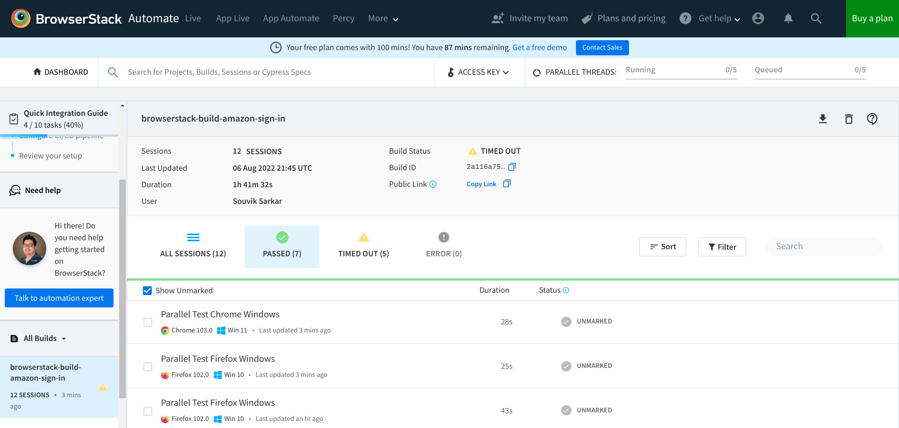
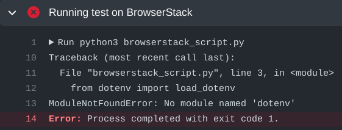

## Context

### Challenges in QA automation

Automated testing of modern websites and mobile applications poses the following primary challenges:

- The tests must run on numerous combinations of devices and browsers in parallel to speed up the process.
- The tests must be triggered for each new build of the application, or for each new code submission by developers.
- Logging and observability of test runs must be transparent, and the test results accessible from a single platform.

### BrowserStack's offerings

BrowserStack solves these problems by offering the following:

- A large collection of devices and browser versions on which you can run your tests
- Support for almost all common programming languages and testing frameworks
- Easy integration of large test suites with the BrowserStack platform
- Comprehensive and detailed reports and logs for each test session in a single dashboard
- Support for automated testing pipelines for all common CI/CD technologies
- Intuitive management of users, permissions, and large-scale testing infrastructure
- Detailed documentation and support for everything you can do with BrowserStack
- Transparent and reasonable pricing for individual users, small teams, and enterprises

## Objectives

This tutorial helps you familiarize yourself with BrowserStack's capabilities, so that you can easily adopt BrowserStack for testing websites and mobile applications. In particular, you will learn about the following:

- Creating and running a test automation script using Python and Selenium on your local machine. The script automatically tests signing in to Amazon's website.
- Adapting the script to use BrowserStack's capabilities, and running tests remotely on BrowserStack.
- Automating the running of tests using GitHub Actions for each modified version of the script.

## Audience

The ideal audience for this tutorial is professionals with interest or experience in automated testing of websites and mobile applications.

::: {.callout-warning}
The code samples used in this tutorial are for demonstration only; DO NOT use them in production scenarios.
:::

## Prerequisites

Before starting with test automation, ensure the following:

- Git is installed on your local machine. You can download it from the [git-scm](https://git-scm.com) website.
- You are familiar with Python and Selenium for automated tests.
- You have an active GitHub account. If not, sign up for an account.
- You have a basic idea about Continuous Integration (CI) pipelines.

## Testing on a local machine

Before running a script on BrowserStack's grid, create and test the simpler version of the script on your local machine.

::: {.callout-note}
All command examples and code snippets included in this tutorial have been tested on a local machine running the Fedora 35 operating system. Whenever necessary, modify the commands and code snippets according to your machine's operating system and package manager.
:::

### Installing dependencies on the local machine

Before creating a test script, ensure that your local machine has all necessary dependencies.

1. Write the following script in a file `set_up.sh` to create a virtual environment and install dependencies:

   ```bash
   # Set up and activate a Python virtual environment.
   cd browserstack-assignment/
   python -m venv browserstack
   source browserstack/bin/activate

   # Install selenium v 4.1.0
   python -m pip install selenium==4.1.0

   # Install python-dotenv package for handling environment variables from the test script
   python -m pip install python-dotenv
   ```

2. Run the `set_up.sh` script file:

   ```bash
   bash set_up.sh
   ```

3. Check the version of Google Chrome on your machine by running `chrome://version/` in the browser's address bar. Note the version, such as `Google Chrome: 104.0.5112.79 (Official Build) (64-bit)`.

4. Check the version of any `chromedriver` package installed on your system:

   ```bash
   chromedriver --version
   # ChromeDriver 96.0.4664.45 (76e4c1bb2ab4671b8beba3444e61c0f17584b2fc-refs/branch-heads/4664@{#947})
   ```

5. If the version of the `chromedriver` package is older than the Google Chrome version, remove the `chromedriver` package:

   ```bash
   which chromedriver
   # ~/bin/chromedriver
   rm ~/bin/chromedriver
   ```

6. Install the `chromedriver` package that matches the Google Chrome version.
   - Download the correct version for your system from the Chromium website.
   - Unzip the downloaded file and navigate to the resulting directory.
   - Copy the `chromedriver` binary to any location supported by your `$PATH` variable.

### Locally running a test script

1. Create a `.env` file and save your Amazon sign-in credentials in the file:

   ```
   AMAZON_EMAIL="<email_registered_with_amazon>"
   AMAZON_PASSWORD="<password_for_amazon_account>"
   ```

   ::: {.callout-note}
   You can safely use the `.env` file for storing Amazon sign-in credentials while experimenting and developing the scripts. The `.gitignore` file has an entry for the `.env` file to prevent any accidental check-ins.
   :::

2. Create a file `local_script.py`:

   ```python
   import os, time
   from selenium.webdriver import Chrome
   from selenium.webdriver.common.by import By
   from dotenv import load_dotenv

   # Helper function to mimic slow typing by a human
   def slow_typing(element, text):
       for character in text:
           element.send_keys(character)
           time.sleep(0.3)

   AMZ_URL = "https://amazon.in/"
   load_dotenv()

   AMAZON_EMAIL = os.environ.get("AMAZON_EMAIL")
   AMAZON_PASSWORD = os.environ.get("AMAZON_PASSWORD")

   browser = Chrome()
   browser.get(AMZ_URL)
   time.sleep(2)
   sign_in_button = browser.find_element(By.ID, "nav-link-accountList")
   sign_in_button.click()
   time.sleep(2)

   username_textbox = browser.find_element(By.ID, "ap_email")
   slow_typing(username_textbox, AMAZON_EMAIL)
   time.sleep(2)

   continue_button = browser.find_element(By.ID, "continue")
   continue_button.submit()
   time.sleep(2)

   password_textbox = browser.find_element(By.ID, "ap_password")
   slow_typing(password_textbox, AMAZON_PASSWORD)
   time.sleep(2)

   sign_in_button = browser.find_element(By.ID, "auth-signin-button-announce")
   sign_in_button.submit()
   time.sleep(5)

   browser.close()
   ```

3. Run the file `local_script.py`:

   ```bash
   python local_script.py
   ```

## Integrating the script with BrowserStack

After successfully testing the script on your local machine, modify and integrate the script with BrowserStack.

### Getting BrowserStack secrets

1. Sign up for a trial account of BrowserStack.
2. Navigate to your BrowserStack dashboard.
3. From the *ACCESS KEY* dropdown menu, note the values of the *User Name* and *Access Key* fields.
4. In the `.env` file, add the BrowserStack secrets below the Amazon account credentials and save it:

   ```
   BROWSERSTACK_USERNAME="<your_browserstack_username>"
   BROWSERSTACK_ACCESS_KEY="<your_browserstack_access_key>"
   ```

   The final content of the `.env` file is similar to the following:

   ```bash
   $ cat .env
   AMAZON_EMAIL="<email_registered_with_amazon>"
   AMAZON_PASSWORD="<password_for_amazon_account>"
   BROWSERSTACK_USERNAME="<your_browserstack_username>"
   BROWSERSTACK_ACCESS_KEY="<your_browserstack_access_key>"
   ```

### Modifying the test script

Modify the script to use BrowserStack's capabilities of running parallel tests on numerous device and browser combinations. The entire modified script, named `browserstack_script.py`, is given below:

```python
import os, time
from dotenv import load_dotenv
from selenium import webdriver
from selenium.webdriver.chrome.options import Options as ChromeOptions
from selenium.webdriver.firefox.options import Options as FirefoxOptions
from selenium.webdriver.common.by import By
from threading import Thread

load_dotenv()

BUILD_NAME = "browserstack-build-amazon-sign-in"

capabilities = [
    {
        "browserName": "chrome",
        "browserVersion": "103.0",
        "os": "Windows",
        "osVersion": "11",
        "sessionName": "Parallel Test Chrome Windows",
        "buildName": BUILD_NAME
    },
    {
        "browserName": "firefox",
        "browserVersion": "102.0",
        "os": "Windows",
        "osVersion": "10",
        "sessionName": "Parallel Test Firefox Windows",
        "buildName": BUILD_NAME
    },
]

def get_browser_option(browser):
    switcher = {
        "chrome": ChromeOptions(),
        "firefox": FirefoxOptions(),
    }
    return switcher.get(browser, ChromeOptions())

def run_session(cap, AMZ_URL="https://amazon.in/"):
    cap["userName"] = os.environ.get("BROWSERSTACK_USERNAME")
    cap["accessKey"] = os.environ.get("BROWSERSTACK_ACCESS_KEY")
    options = get_browser_option(cap["browserName"].lower())
    options.set_capability("browserName", cap["browserName"].lower())
    options.set_capability("bstack:options", cap)
    driver = webdriver.Remote(
        command_executor="https://hub.browserstack.com/wd/hub", options=options
    )
    driver.get(AMZ_URL)
    sign_in_button = driver.find_element(By.ID, "nav-link-accountList")
    sign_in_button.click()
    time.sleep(2)

    AMAZON_EMAIL = os.environ.get("AMAZON_EMAIL")
    AMAZON_PASSWORD = os.environ.get("AMAZON_PASSWORD")

    username_textbox = driver.find_element(By.ID, "ap_email")
    username_textbox.send_keys(AMAZON_EMAIL)
    time.sleep(2)

    continue_button = driver.find_element(By.ID, "continue")
    continue_button.submit()
    time.sleep(2)

    password_textbox = driver.find_element(By.ID, "ap_password")
    password_textbox.send_keys(AMAZON_PASSWORD)
    time.sleep(2)

    sign_in_button = driver.find_element(By.ID, "auth-signin-button-announce")
    sign_in_button.submit()
    time.sleep(2)

    print("Sign in test complete.")
    driver.quit()

for cap in capabilities:
    Thread(target=run_session, args=(cap,)).start()
```

### Running the modified script on BrowserStack

```bash
python browserstack_script.py
```

### Observing test results in the BrowserStack dashboard

You can monitor tests, inspect logs, and access other details of test sessions using the BrowserStack dashboard.

1. In your BrowserStack dashboard, select the build from the *All Builds* drop-down list on the left navigation pane.
2. Check the status of the sessions for the selected build.



## Automatically running the modified script using GitHub Actions

Using GitHub Actions, set up a CI pipeline such that each push or pull request to the project's GitHub repository triggers the tests to run on BrowserStack.

1. Create a `.gitignore` file to prevent the environment secrets from getting pushed to a remote repository on GitHub:

   ```bash
   echo ".env" >> .gitignore
   ```

2. Create a GitHub repository named `browserstack_automation` for the project and push the local project to the remote repository:

   ```bash
   git init
   git add --all
   git commit -m "first commit"
   git branch -M main
   git remote add origin git@github.com:<username>/browserstack_automation.git
   git push -u origin main
   ```

3. In your repository on GitHub, navigate to *Settings → Secrets (left navigation pane) → Actions → New repository secret*.
4. Add your BrowserStack secrets that are available in the `.env` file of your project directory:
   - Name: `BROWSERSTACK_USERNAME`, Value: `<your_browserstack_username>`
   - Name: `BROWSERSTACK_ACCESS_KEY`, Value: `<your_browserstack_access_key>`
5. In the repository root, create a `.github/workflows/browserstack_actions.yml` file that defines the GitHub Actions workflow:

   ```yaml
   name: 'BrowserStack GH Actions Test'
   on: [push, pull_request]
   jobs:
     ubuntu-job:
       name: 'BrowserStack Test on Ubuntu'
       runs-on: ubuntu-latest
       steps:
         - name: 'BrowserStack Env Setup'
           uses: browserstack/github-actions/setup-env@master
           with:
             username: ${{ secrets.BROWSERSTACK_USERNAME }}
             access-key: ${{ secrets.BROWSERSTACK_ACCESS_KEY }}

         - name: 'BrowserStack Local Tunnel Setup'
           uses: browserstack/github-actions/setup-local@master
           with:
             local-testing: start
             local-identifier: random

         - name: 'Checkout the repository'
           uses: actions/checkout@v2

         - name: 'Setting up the runner'
           run: bash set_up.sh

         - name: 'Running test on BrowserStack'
           run: python3 browserstack_script.py

         - name: 'BrowserStackLocal Stop'
           uses: browserstack/github-actions/setup-local@master
           with:
             local-testing: stop
   ```

6. To test the GitHub Actions workflow, make a minor modification in the project and push the changes to GitHub:

   ```bash
   git add <modified_file>
   git commit -m "Testing GitHub Actions"
   git push
   ```

7. In your GitHub repository, navigate to *Actions → \<your_GitHub_Actions_job\>* and observe the job logs.

   ::: {.callout-note}
   One of the common reasons of failure for the `browserstack_actions.yml` workflow is the following error: `ModuleNotFoundError: No module named 'dotenv'`.

   

   The failure happens due to a known bug. The bug is not easily reproducible, and currently has no known solutions that are universally applicable.
   :::

8. In your BrowserStack dashboard, select the GitHub Actions build from the *All Builds* drop-down list on the left navigation pane, and observe the test status.

::: {.callout-note}
A modified and hopefully better version of this project is available on [GitHub](https://github.com/sounix000/browserstack-qa-automation).
:::
