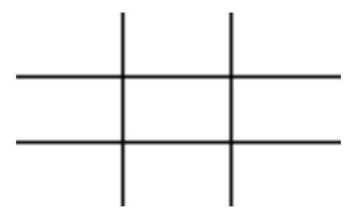
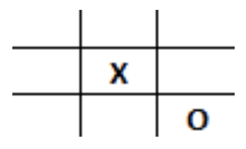
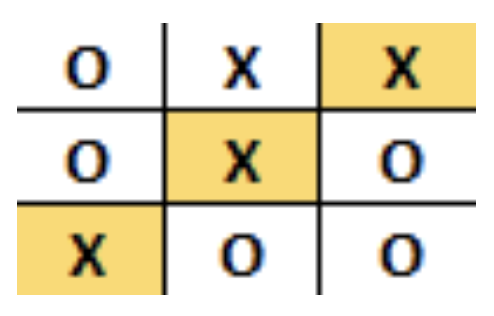
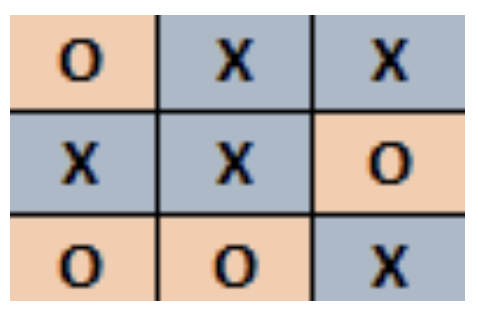
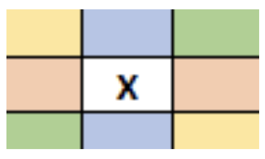
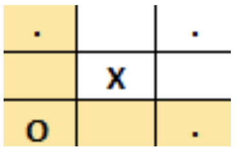
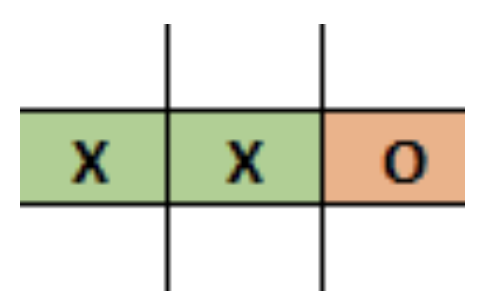
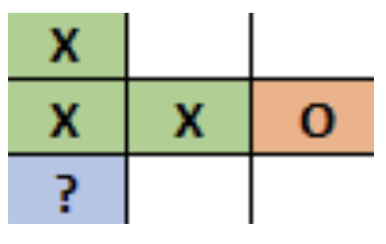
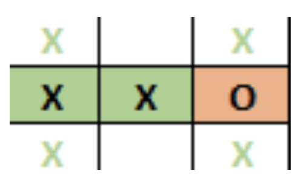
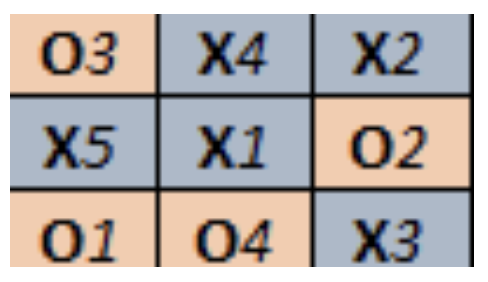

## Overview

Tic-tac-toe is a simple and fun game that you can play anywhere. To play, you need a 3x3 grid and an opponent. You can also practice against yourself or a computer and surprise your friends with your unbeatable skills.

{fig-align="center" width="40%"}

## Rules

The rules of the game are as follows:

- You and your opponent choose either X or O as your symbol. If you choose O, your opponent will get X.
- On your turn, place your symbol in any vacant cell in the 3x3 grid. The first player can place their symbol in any of the nine cells.

  {fig-align="center" width="40%"}

- The goal is to mark three consecutive cells in a straight line. This can be horizontal, vertical, or diagonal. *The first player to mark three consecutive cells wins the game.*

  {fig-align="center" width="40%"}

- *If neither player marks three consecutive cells before the grid is full, the game ends in a draw.*

  {fig-align="center" width="40%"}

## How do you avoid losing?

Tic-tac-toe is a zero-sum game, meaning that *if both players make the best possible moves, the game will always end in a draw*. Computer games are often programmed based on this principle. You can play these games to practice and improve your chances of not losing.

The real fun is playing against human opponents because they are prone to making mistakes. *You can win or force a draw if you follow these strategies*:

- On your first move, always place your symbol in the center (the middlemost cell). This gives you the most opportunities to create a straight-line arrangement in all four directions (horizontal, vertical, and two diagonals).

  {fig-align="center" width="40%"}

- If your opponent starts by placing their symbol in the center, place your symbol in one of the four corners. This gives you the chance to extend your line in both horizontal and vertical directions.

  {fig-align="center" width="40%"}

  ::: {.callout-tip}
  You can use this tactic at any move, provided your opponent is two or more steps away from winning.
  :::

- If your opponent has already marked two consecutive cells, block the third cell in that line. Remember, once your opponent marks three consecutive cells, the game is over.

  {fig-align="center" width="40%"}

- If your opponent has multiple ways to complete a line, blocking one path may not be enough. In this case, you will lose regardless of which path you block.

  {fig-align="center" width="40%"}

- If you are blocked, explore other open directions to maximize your chances. It is also important to use the cells you have already marked strategically.

  {fig-align="center" width="40%"}

## Example

In the $i$-th move of a sample game, your opponent places their symbol as $X_i$, and you place your symbol as $O_i$. From the figure, you can understand the game's progression and outcome.

{fig-align="center" width="40%"}

If a 3x3 grid is too simple for you, try a 4x4 or 5x5 grid. But always stay alert and *anticipate your opponent's next two moves*. Most importantly, have fun playing tic-tac-toe!
