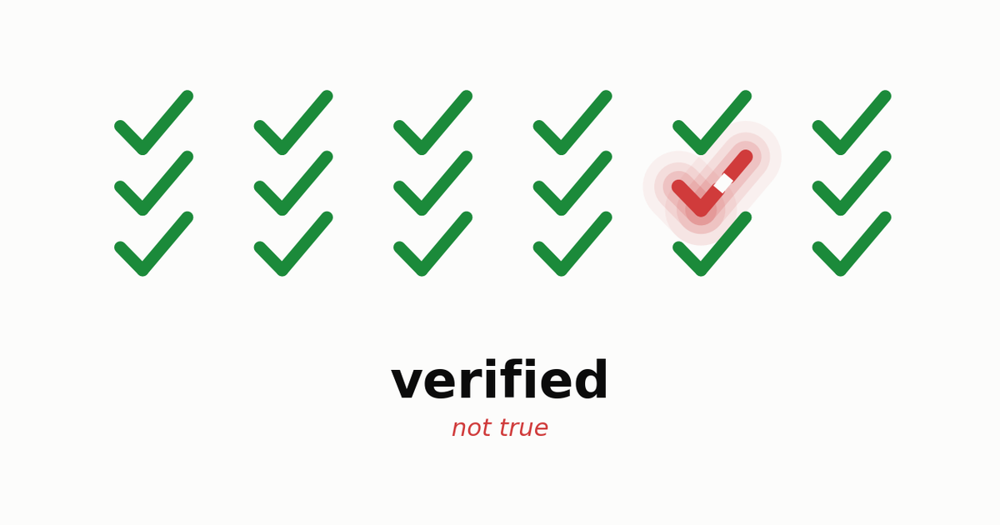
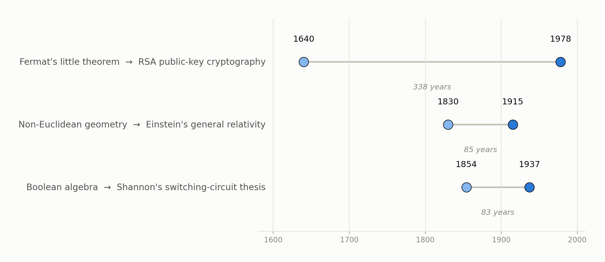
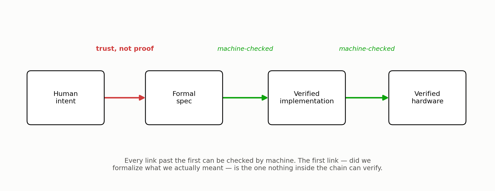
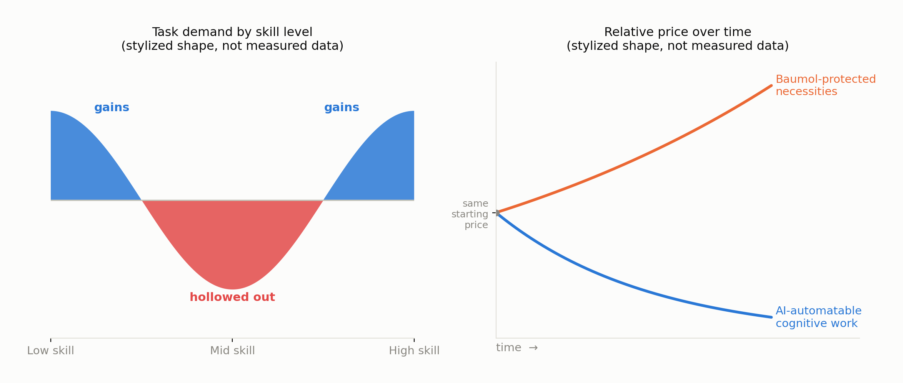

{fig-align="center" width="65%"}

A proof used to be expensive. You'd spend an afternoon, a week, sometimes a career, and at the end you had a small number of sentences you could stand behind completely. That scarcity carried information in itself: if someone had bothered to prove something, it probably mattered enough to justify the cost. Machines are quietly removing that signal. A language model can now produce a working implementation, a full test suite, and increasingly a machine-checked proof of correctness, in roughly the time it takes to read this sentence. Proof is becoming ambient, which is a strange thing to say out loud given how recently it wasn't. And ambient proof turns out to answer a narrower question than most of us have been giving it credit for. If you've spent the last few years telling yourself that judgment is the safe part of the job and the grunt work is what's disappearing, it's worth sitting with how much of that comfort was ever actually earned.

## Two questions we used to answer with one word

::: {.column-margin}
Boehm wrote this before anyone trusted a compiler by default. It reads now like a prophecy about a much bigger kind of building.
:::

Barry Boehm gave software engineering its cleanest vocabulary for this back in 1979, and it's aged better than almost anything else from that decade [@boehm1979]: **verification** asks *are we building the product right?* **Validation** asks *are we building the right product?* For most of software's history these lived in the same head. A programmer validated implicitly while verifying, simply because both processes were slow enough that one person could hold the whole loop, from spec to output, in mind at the same time. That's no longer true. Verification is cheap and mechanical now and ships instantly. Validation still needs a mind that can hold the artifact next to the world and actually notice when the two have drifted apart. Most of what follows is one argument told from several angles: verification is being automated faster than almost anything else in the history of software, and validation isn't keeping pace, for reasons that turn out to be more interesting than a simple "not yet."

## Where the checking stops

Start with the obvious rebuttal: build a verifier for the verifiers. Prove the spec satisfies a meta-spec, prove the meta-spec satisfies a meta-meta-spec, and keep recursing until it's AI checking AI checking AI, no person needed anywhere in the loop. This works about as well as writing an interpreter in the language it interprets, which is an old and genuinely useful trick, but one that always needs some host system underneath willing to just run without being asked to justify itself. Push the recursion as far as you like; you still land on something taken as given rather than derived. An axiom. A root spec. Some foundational choice about what "correct" even means here that nobody inside the system gets to question.

::: {.column-margin}
Turtles all the way down, except eventually you run out of turtles and have to stand on something.
:::

This isn't just a practical shrug of a limitation, either. It rhymes with something Gödel actually proved in 1931: a sufficiently expressive formal system can't establish its own consistency using only its own resources [@godel1931].[^godel] I don't want to lean on that analogy too hard. A spec isn't an axiomatic system, and "was this the right thing to build" isn't the same question as "is this system consistent." Even so, the shape carries over well enough to be worth noticing. Nothing inside a verification stack, however many layers deep, can certify that its own foundation was the right one to pick. Something outside the stack, a person or otherwise, has to decide the axiom is good, and the only court that ever actually rules on that is how the world responds afterward. That hasn't happened yet. It can't be checked in advance, by anyone, human or machine.

## The uselessness that wasn't

Here's a reason not to grieve this too quickly. In 1940, G. H. Hardy wrote an entire book in praise of mathematics that would never be useful, and he named number theory, his own field, as the cleanest case of it. His actual line: "No one has yet discovered any warlike purpose to be served by the theory of numbers or relativity, and it seems very unlikely that anyone will do so for many years" [@hardy1940]. Thirty-eight years later, RSA was built out of the very number theory he'd been pointing at, modular exponentiation and the difficulty of factoring, resting on a pattern Fermat noted in a 1640 letter and Euler generalized in 1763[^fermat] [@rsa1978]. It's still, in one form or another, why your browser trusts your bank. Hardy wasn't wrong about war. He just hadn't thought of banking, and the lag turned out to be longer than his own career. George Boole worked out a two-valued algebra for logic in 1854 with no application in mind whatsoever. It sat there until Claude Shannon's 1937 master's thesis showed it could design a switching circuit, a thesis that's arguably the founding document of every digital computer built since [@shannon1938]. Non-Euclidean geometry spent the better part of a century as an elegant curiosity before Einstein needed its machinery to write down general relativity.

Abraham Flexner made the argument explicit in 1939: research aimed at application is usually worse at producing application than research aimed at nothing but the truth of the matter [@flexner1939]. Utility isn't really a target you can aim at directly. It behaves more like a shadow that some structures cast later, unpredictably, and rarely onto the person who built them. So confident claims that a given line of thought "will never matter" are exactly the wrong kind of claim to be confident about. The honest position is closer to: we can't know, and betting heavily against it has a genuinely bad track record.

{fig-align="center" width="90%"}

## When the badge is cheap, faking the badge is cheaper

Cheap verification creates a second problem that has nothing to do with logic. When a trust signal is expensive to produce, it's usually honest, simply because faking it costs about as much as earning it. Once it becomes cheap, faking it gets cheaper than earning it. George Akerlof gave this exact collapse a name in 1970, "the market for lemons": once buyers can't tell a good product from a bad one, and sellers know it, the market fills up with bad ones and the good ones leave [@akerlof1970]. Mortgage-backed securities carried AAA ratings right up until 2008, because the agencies rating them were paid by the people issuing them, and somewhere along the way the rating had quietly stopped tracking the risk it claimed to measure.[^burry]

"Formally verified" is well on its way to becoming that kind of badge, for software, for AI-generated specs, eventually for hardware. A verification chain is only as honest as every party who fed something into it. An actor with an interest in a backdoor, or a vendor with an interest in shipping fast, doesn't even need to break the proof. All they need is for the proof to be checking the wrong artifact, quietly, with nobody's incentive lined up to notice. The historical versions of this failure, ratings agencies, audited books that weren't, safety certifications issued without the safety, tend to get fixed the same way. More verification rarely does it. What actually fixes it is someone whose job is to distrust the verification and go check by hand. That job doesn't shrink as verification gets cheaper. If anything it gets scarcer and more necessary, precisely because fewer people bother training for it once the badge starts looking sufficient on its own.

{fig-align="center" width="85%"}

## The mind that used to be safe

Distrusting the badge and checking by hand is itself a judgment call, which raises the obvious next question. Is that kind of judgment actually safe from all this, or just safe so far? For decades the safest job in an automating economy was tacit judgment, precisely because it resisted being written down. Michael Polanyi named this in 1966, "we can know more than we can tell," and the observation quietly protected an entire tier of skilled and professional work. If you couldn't articulate the rule, a machine couldn't be handed the rule, so the work stayed safe by default [@polanyi1966]. Hans Moravec noticed the mirror-image fact from the robotics side. The reasoning that looks hard to us, chess, arithmetic, formal proof, turns out to be cheap for a machine, while the sensorimotor competence a toddler gets for free, grasping an odd-shaped object, walking on gravel, is punishingly difficult to engineer [@moravec1988]. Between those two observations sat a comfortable assumption: cognition-heavy judgment is safe because it's tacit, physical work is safe because it's embodied, and machines would only ever eat the codified middle.

Large language models are the technology that has disturbed that assumption most, and most broadly, because they turn out to be unusually good at the tacit, pattern-soaked reasoning Polanyi's paradox was supposed to protect. It isn't even the first dent. Recognizing a face was Polanyi's own textbook example of something we know without being able to say how, and convolutional networks got good at that a full decade before anyone had heard of a transformer. What's different now is the range: not one narrow perceptual skill this time, but judgment itself, at the width of ordinary language. Whether the same thing happens to Moravec's other flank, physical competence, is a live and separate question. Serious people are betting the model side of that gap closes soon; the recent push toward world models trained on video and self-supervised prediction, the kind of program researchers like Yann LeCun have argued is necessary beyond language alone, is aimed at exactly that. But understanding physics inside a model and operating reliably in someone's actual kitchen are different problems, and historically the distance between them has been paid for in capital, certification, and years rather than cleverness.[^selfdriving] A mind can get the physics right and still need a decade to get the body cheap, certified, and trusted. That decade is real, even if it won't last forever.

## Bifurcation, and its limits

The standard economic story about automation is bifurcation rather than elimination. David Autor's account of labor-market polarization is the clean version of it: automation hollows out routine work in the middle of the skill distribution while increasing demand at both ends, low-skill work that resists codification, and high-skill work built around exception-handling and accountability [@autor2015; @autorlevymurnane2003]. ATMs didn't remove bank employees. They removed routine transactions and pushed the remaining humans toward advisory work. Autopilot didn't remove pilots. It removed routine flying and left them as the accountable party for the moments autopilot can't parse. If that pattern holds here, the base layer of writing and checking software commoditizes hard, and a smaller, better-paid tier persists around *auditing the auditors* and holding liability when a "verified" system fails anyway.

::: {.column-margin}
A string quartet takes the same number of musician-hours to perform today as it did in Mozart's time — no productivity gain, ever — while a recording of that same quartet costs almost nothing to reproduce. That gap, not any change in the quartet, is the whole mechanism.
:::

There's a companion mechanism that pushes the scarce tier's price up even as its size shrinks: William Baumol's cost disease, first diagnosed in the performing arts back in 1966 [@baumolbowen1966]. Sectors that resist productivity gains get relatively more expensive over time. Not because they improve, simply because everything around them gets cheaper. If judgment resists automation while implementation gets nearly free, judgment's relative price should climb, and a small number of people doing it very well could end up paid handsomely for a service that took a village a generation ago.

But cost disease isn't a friendly force, and it runs the other way through the very sectors a displaced worker actually needs. Housing is constrained by land and zoning, not labor. Healthcare is constrained by licensing and physical presence. Both resist the price collapse AI brings to everything automatable, and Baumol's logic says they get relatively more expensive just as automatable prices fall around them. The uncomfortable version of this forecast isn't "engineers get replaced by cheaper engineers." It's nominal wages falling across a wide swath of newly automatable work while rent, healthcare, and food hold their price or climb higher still, because cost disease has never once checked whether the patient can afford the treatment.

{fig-align="center" width="100%"}

## The spiral, and whether it's inescapable

::: {.column-margin}
The same essay predicted a 15-hour work week by about now, on the logic that productivity gains this large would simply be shared out as leisure [@keynes1930]. He was right about the productivity. He didn't guess who'd end up keeping the difference.
:::

John Maynard Keynes coined "technological unemployment" in 1930 and called it a temporary phase of maladjustment, workers displaced faster than new work could be invented for them, but only for a while [@keynes1930]. The standard rebuttal to automation panic has leaned on that word, *temporary*, ever since. Every past wave destroyed narrow, specific tasks and left people a comparative advantage at whatever job hadn't been invented yet, because that job still needed general human cognition a machine didn't have. Daniel Susskind's case for why this time may not rhyme deserves to be taken seriously rather than waved off as alarmism [@susskind2020]. If the automation is general rather than narrow, it can fill new job categories nearly as fast as they're invented, which removes the very lag that made every prior transition survivable. Agriculture to manufacturing to services each took the better part of a century, long enough for a generation to retrain, relocate, and adjust its expectations. Compress that into a handful of years and the mechanisms that absorbed the shock before simply don't get the time they need to operate, whether or not they'd eventually have worked in principle.

Mass displacement from cognitively automatable work pushing into physical labor, bidding those wages down too, cutting purchasing power and therefore demand: that's a coherent mechanism, not a fringe worry, and the Baumol point above makes it sharper rather than softer, since the squeeze concentrates on necessities instead of spreading evenly. What keeps it from being a certainty is that it isn't purely a law of economics. It's contingent on two things nobody can currently measure with any confidence. One is the actual speed at which general capability closes the remaining gaps, cognitive and physical both. The other is whether the institutional machinery built for exactly this kind of shock, unemployment insurance, progressive taxation, the scale of discretionary intervention used in 2008 and 2020, gets deployed fast and large enough. That's a question about political will under polarization. The tools already exist.

There's one narrower, more durable mechanism worth naming on its own. Liability doesn't dissolve just because verification got cheap. Someone still has to be the named, accountable party when an AI-verified system fails in the world, a licensed engineer, a signing officer, an insurer pricing the risk, and that role gets compensated for bearing the accountability almost independent of how much of the underlying thinking a machine actually did. It's a thinner floor than a skilled profession used to stand on, but it's a real one. Of everything in this piece, it's the part I'd actually bet on holding.

## What's actually worth training

None of this resolves neatly into "learn to code" or "learn to verify," because both of those are the layer being eaten. What's left is narrower and harder to market: the capacity to hold a formal artifact, a spec, a proof, a model, a badge, next to the reality it claims to represent, and notice the exact moment the two have quietly come apart. This was never going to be rewarded automatically the way a licensed profession was rewarded across the twentieth century, whether or not you loved the work. It ran, always, on a small number of people who would have trained themselves anyway, for the plain pleasure of getting the model right, market or no market underneath them. What's changed isn't whether that's worth having. It's how much now rides on whether anyone still bothers.

> A proof will always check out. Whether it was proving the right thing is the one question nothing currently being built can answer for you.

[^godel]: Strictly, this is Gödel's *second* incompleteness theorem; the first, related but distinct, establishes that any such system contains true statements it cannot prove.

[^fermat]: Fermat stated the underlying observation in a 1640 letter without a general proof; Euler supplied the generalization in 1763 that RSA's correctness argument actually leans on. The seed insight is still Fermat's.

[^burry]: The investors who saw the 2008 collapse coming and profited from it — Michael Burry's trade being the most famous — made their money by refusing to trust the AAA badge and reading the underlying loan tapes themselves.

[^selfdriving]: Public self-driving demonstrations go back roughly a decade; as of this writing, commercial robotaxi service is still geographically limited and closely regulated rather than available on ordinary roads everywhere. The lag has run through insurance law and long-tail edge cases, not through the driving-policy models.
